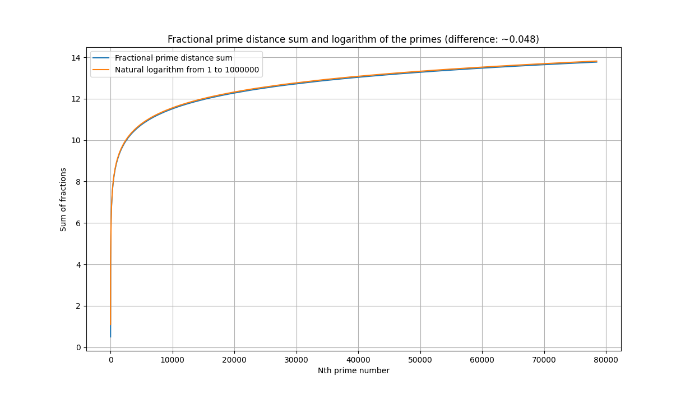

# Sums of fractional distances between primes #

Running this program plots the sums of distances between consecutive prime numbers divided by the smaller prime number, alongside the natural logarithm of the smaller of the two primes.

The prime summation thus works like this:

$\sum\limits^N_{i=2} \frac{P_i - P_{i-1}}{P_{i-1}}$,

where N is the number of primes in the range defined by the command line argument, $P_i$ is the ith prime number and $P_{i-1}$ is the (i-1)th prime number. 

Thus, the first terms of the sum are

$\frac{3 - 2}{2} + \frac{5 - 3}{3} + \frac{7 - 5}{5} + \frac{11 - 7}{7} + ...$

and so on.

## Running the program ##

To run the program type

`python primedistfracs.py [positive integer]`

for example,

`python primedistfracs.py 1000`

which calculates and plots the fractional prime sums for all primes between 1 and 1000. 

The resulting plots look like this: 

From the plot you can see that the difference between the sum of fractional differences between consecutive primes until prime $P_i$ is very close to the natural logarithm of $P_i$, with a difference that converges to ~0.0478. 

This finding seems to be related to the [Prime number theorem](https://en.wikipedia.org/wiki/Prime_number_theorem) which states that the average gap between consecutive primes among the first N integers is roughly log(N).

